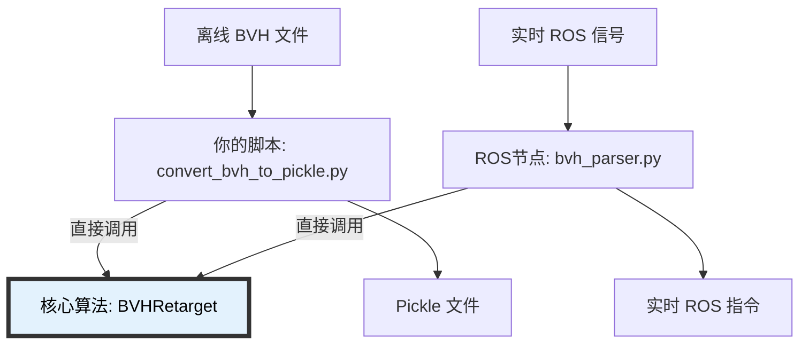

代码库的设计遵循了“核心逻辑与接口分离”的原则：

核心算法层 (纯 Python，无 ROS 依赖)

文件: retarget.py
类: BVHRetarget
作用: 负责纯粹的数学计算（IK 解算、重定向）。它不关心数据是从文件读进来的，还是从网络发过来的。
你的脚本用到了它: from motion_retargeting.retarget.retarget import BVHRetarget
在线/实时接口层 (ROS2 依赖)

文件: bvh_parser.py
类: BVHParser(Node)
作用: 这是一个 ROS2 节点包装器。它引入了 rclpy，负责监听 ROS 话题，把收到的数据喂给 BVHRetarget，然后再把结果发布出去。
你的脚本没有用它: 如果你 import 这个文件，Python 就会报错说找不到 rclpy（除非你在 ROS 环境下）。
离线/文件接口层 (你的脚本)

文件: convert_bvh_to_pickle.py
作用: 这是一个文件处理包装器。它负责读写文件，把文件数据喂给 BVHRetarget，然后保存结果。
总结回答你的问题
不需要 ROS2 环境吗？
是的，不需要。因为你的脚本直接绕过了 bvh_parser.py (ROS 层)，直接去拿了底层的 BVHRetarget (算法层)。只要你的 Python 环境里有 numpy, scipy 等基础库即可。

bvh_parser.py 的作用？
正如你所说，它是为了实时场景设计的。它启动后会作为一个 ROS 节点存在，等待其他节点给它发指令或数据流，处理完再实时发给仿真器或真机。

